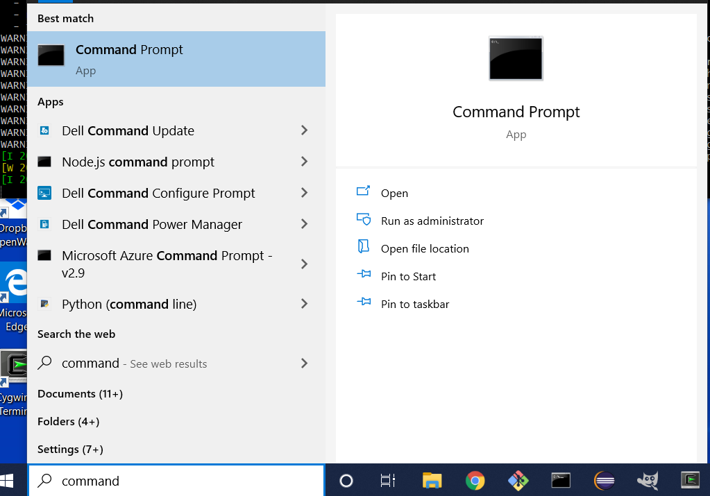

# Development Environment / Command Line #

The following information explains how to open a command line tool on different operating systems.
Many development tasks are performed using a command line environment.

| **Operating System** | **Step** | **Description** |
| -- | -- | -- |
| **Prerequisites** | | |
|  | Git for Windows | [Install Git for Windows](../git/git.md) to use Git Bash (optional). |
|  | Cygwin | [Install Cygwin on Windows](http://learn.openwaterfoundation.org/owf-learn-cygwin) if using Cygwin environment (optional). |

| **Operating System** | **Instructions** | **Description** |
| -- | -- | -- |
|  | See below:  [Command Prompt on Windows](#command-prompt-on-windows) | Open a command prompt on Windows. |
|  | See below:  [Git Bash on Windows](#git-bash-on-windows) | Open a Git Bash shell on Windows. |
|  | See below:  [Terminal on Cygwin](#terminal-on-cygwin) | Open a terminal on Cygwin. |
|  | See below:  [Terminal on Linux](#terminal-on-lines) | Open a terminal on Linux. |

------------------

##  Command Prompt on Windows ##

The Windows `cmd` program provides access to the Windows command line using a ***Command Prompt*** window.
Note that Windows also provides PowerShell;
however, PowerShell is intended for system administration tasks and most development tools rely on the command prompt shell.
The default in Windows 10 is to list PowerShell when right-clicking on Windows ***Start***.

Use one of the following ways to open a command prompt window:

1. Click on the ***Windows*** icon in the lower left of the task bar.
In the search area, type `command` or `cmd`.
Select `Command Prompt` to run the `cmd` program.
Once it is run a few times, the application should show up in favorite applications in the ***Start*** menu. 
**

.

**
**

Starting the Windows Command Prompt `cmd` Program from the Start Menu

**

2. Use the ***Windows+r*** keys, which will show the ***Run*** tool.  Then enter `cmd` as the program to run.
Press ***OK*** to confirm. 
**

.

**
**

Starting the Windows Command Prompt `cmd` Program from ***Run*** Tool 

**

A `cmd` window will then start, as shown below.
The default prompt is the current folder.
Windows built-in commands and program names can be typed on the command line.
If the folder of the software is found in the `PATH` environment variable, the software will run.
Otherwise, the path to the program needs to be entered at the command prompt (or `cd` to the folder where the
software exists and enter the program name).
See also the [`cmd` program documentation](https://docs.microsoft.com/en-us/windows-server/administration/windows-commands/cmd).

**

**

**

Command Prompt Window for `cmd` Program

**

A normal `cmd` session can be used most programming activities.
However, if administrator privileges are required, for example to install software,
then run the `cmd` program as administrator by right-clicking on the program name,
as shown below.

**

**

**

Starting a Command Prompt Window as Administrator

**

A prompt for the administrator password will be shown and the opened ***Command Prompt*** window title bar displays as ***Administrator Command Prompt***.
Note that the initial folder is the location of Windows system files.
**It is recommended to only use administrator privileges as needed and close the window as soon as adminstrator tasks are complete.**

**

**

**

Command Prompt Window for `cmd` Program as Administrator

**

##  Git Bash on Windows ##

If the Git software is installed on Windows, then a Linux-like command line shell can be started by 
using the ***Start / Git / Git Bash*** menu item.  A window similar to the following will be shown.
Git Bash uses the [MinGW](http://www.mingw.org/) software to provide Linux features on Windows and
also provides access to Windows programs, including adding the Windows `PATH` folders to the Git Bash `PATH`
environment variable.
Note that the home folder for Git Bash is the same as Windows but must be accessed using `/c/Users/user`,
where `user` is the specific user.

**

**

**

Command Prompt (bash shell) for Git Bash

**

##  Terminal on Cygwin ##

If the Cygwin software is installed on Windows, then a Linux-like command line shell can be started by 
using the ***Start / Cygwin / Cygwin64 Terminal*** menu item.  A window similar to the following will be shown.
Cygwin software provides Linux features on Windows and
also provides access to Windows programs by adding Windows `PATH` folders to the Cygwin `PATH`
environment variable.
Note that the home folder for Cygwin (`/home/user`) is NOT same as Windows and therefore the
user's Windows files must be accessed using `/cygdrive/c/Users/user` folder,
where `user` is the specific user.

**

**

**

Command Prompt (bash shell) for Git Bash

**

##  Terminal on Linux ##

A terminal window is typically opended on Linux using the ***Applications*** menu or similar.
The Bash shell is typical, although other shells might be used to provide a command prompt.
