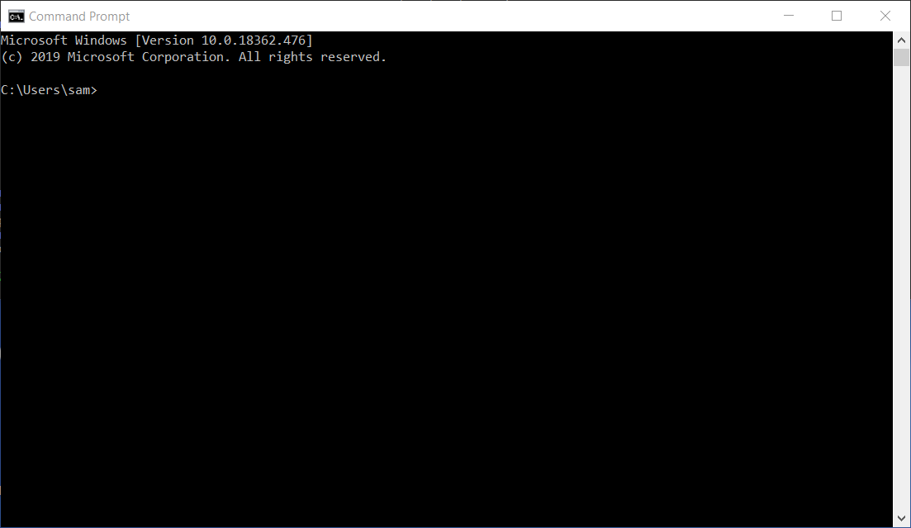
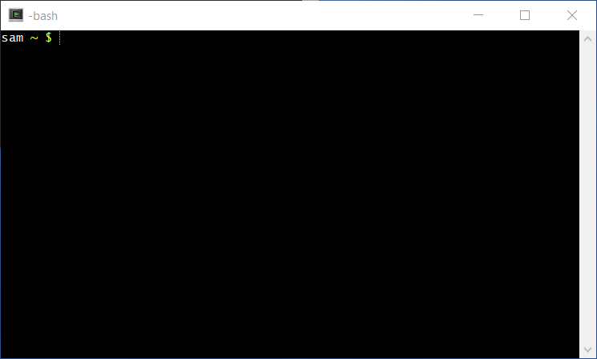
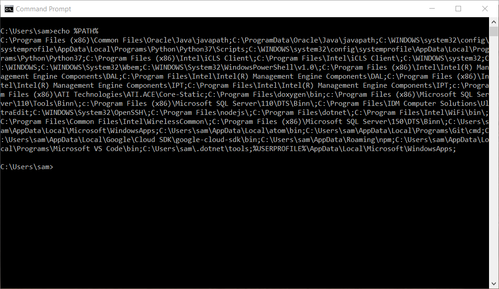
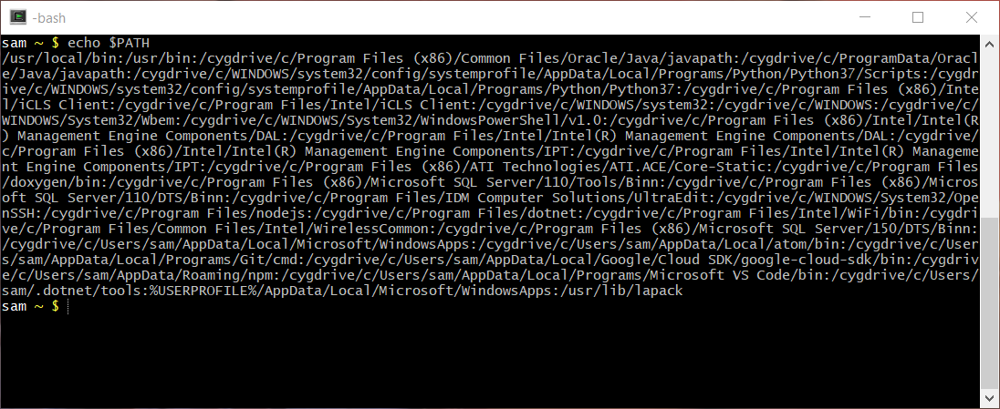
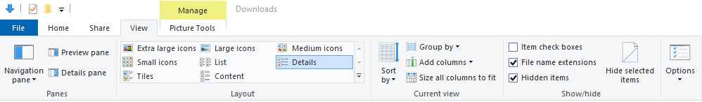

# Lesson / Operating Systems

**Level:  Basic**

**Estimated Time:  30 Minutes**

* [Lesson Introduction](#lesson-introduction)
* [Prerequisites](#prerequisites)
* [Background](#background)
* [Command Line Interpreter and Shells](#command-line-interpreter-and-shells)
* [Folders and Directories](#folders-and-directories)
* [Environment Variables](#environment-variables)
* [`PATH` Environment Variable](#path-environment-variable)
* [Filenames, Extensions, and Permissions](#filenames-extensions-and-permissions)
* [Batch Files and Scripts](#batch-files-and-scripts)
* [See Also](#see-also)

---------

## Lesson Introduction ##

This lesson provides background information about operating systems concepts that impact programs.
It is important to understand how the operating system integrates with programs
that are run within the operating system environment.

## Prerequisites ##

This lesson requires access to a Windows or Linux computer.

## Background ##

An "operating system" (OS) is system software that runs on computer hardware and interfaces software applications to hardware
([see "Operating system" on Wikipedia](https://en.wikipedia.org/wiki/Operating_system)).
Operating system software is complex and requires extensive effort to develop and support,
in order to ensure integration with computer hardware and support various software.

Common operating systems include Windows, Linux, and Mac OS.
Additionally
[Cygwin](https://www.cygwin.com/) and
[MinGW (see Wikipedia)](https://en.wikipedia.org/wiki/MinGW)
are operating systems that provide Linux-like features while running on Windows.
MinGW is installed to provide Git for Windows, which is a common version control system.
Although operating systems have many similar characteristics,
they also differ in basic ways, such as location of files.
It is possible to write software programs that will run on different operating systems
and programming languages provide features to handle operating system differences.

Operating system software consists of software layers that integrate computer hardware with user-facing software.
Operating systems such as Windows provide graphical user interfaces (GUIs) that display information in a "desktop"
with movable windows, mouse, and keyboard interaction.
For example, the Windows file explorer displays, folders and files and allows accessing files with appropriate programs.
GUI programs, although useful, are essentially a wrapper around core software that has more fundamental functionality.
Such programs also require understanding software components that are more advanced.
This documentation focuses first on programs without GUI, with GUI discussed as an advanced topic.

Text-based "command line" interfaces to operating systems are available on all operating systems.
These interfaces allow running operating system programs.

## Command Line Interpreter and Shells ##

A "command line interpreter" is an operating system program that displays a user prompt
and waits for user input to run a program.
On Linux operating system, command line interpreters are typically called "shells".

Gaining an understanding of the operating system via its command line interface is recommended to any programmer,
in order to understand how software integrates with the operating system.
Batch files on Windows and shell scripts on Linux are often used in software development
environment to help automate tasks.

###  Windows Command Prompt ###

On Windows, typing "command" in the run search tool finds the ***Command Prompt*** app, 
which will display a window similar the following:

**<p style="text-align: center;">

</p>**

**<p style="text-align: center;">
Windows Command Prompt (<a href="../WindowsCommandPrompt1.png">see also the full-size image</a>)
</p>**

The `C:\Users\sam>` in this case indicates the current user's home folder,
followed by `>` prompt character.

[Windows commands](https://docs.microsoft.com/en-us/windows-server/administration/windows-commands/windows-commands) can be run
by typing the command name followed by command line parameters for that command.
For example, the `dir` command lists folders and files in the current directory (a "directory" is an older term used interchangeably with "folder").
Windows commands typically use the `/` character to indicate command options.
For example, using `dir /?` prints available command options.
Software that runs on Windows and Linux typically uses single dash (`-`) or double dash (`--`) to indicate command options
because forward slash on Linux indicates folders.

Use the `exit` command to close the ***Command Prompt*** window.

Most programs that can be accessed via the Windows graphical desktop can also be run on the command line.


###  Linux Shell ###

On Linux and variants (Cygwin, MinGW, etc.), a terminal window is usually available from the desktop menu.
For example, the following is a Cygwin terminal window.
The `$` character is used for the command line prompt and may change depending on the user,
for example `#` is often used for the "root" (administrative) user.

**<p style="text-align: center;">

</p>**

**<p style="text-align: center;">
Cygdrive Terminal Window (<a href="../CygwinBash1.png">see also the full-size image</a>)
</p>**

The `ls` Linux command lists files.
Additionally, the `dir` command can also be used on Cygdrive and MinGW because
these operating systems allow running Windows programs.
Linux commands and programs typically use single dash (`-`) for single-character
command options and double dash (`--`) for multi-character command options,
for example `-h` and `--help` to print command usage.

There are multiple shell programs, including older `sh` and newer `bash`,
which provides useful features to streamline scripting and automation.

Use the `exit` command to exit the shell.

There are many Linux programs.  For example, see [Linux man pages](https://linux.die.net/man/).

## Folders and Directories ##

Operating systems organize files into folders (also called directories).
Operating systems have standard folders to organize the many files on a computer.
Folders are organized into system folders that require administrative privileges and user files.

###  Windows Folders ###

Windows uses "drives" to store files.
The notation `C:\` indicates files stored on the "C drive".
Windows uses the backslash character (`\`) to separate folders into different levels.
For example:  `C:\folder1\folder2\folder3\somefile`.

The `C:\Users\user` folder
(where `user` is the user name) is used for user files.
Other drives are used for other hard drives, USB drives, DVD drives, etc.

See also ["Directory structure" on Wikipedia](https://en.wikipedia.org/wiki/Directory_structure).

###  Linux Folders ###

Linux uses the forward slash character (`/`) to separate folders into different levels.
Linux does not use drive letters and instead the "root folder" or "root directory" `/`
organizes all files.
For example:  `/folder1/folder2/folder3/somefile`.

On Linux, the `/home/user` folder is used for a user's files.

See also the ["Filesystem Hierarchy Standard" (Wikipedia)](https://en.wikipedia.org/wiki/Filesystem_Hierarchy_Standard).

## Environment Variables ##

An operating system keeps a list of "environment variables" that help interface
the user's environment and software to the operating system.
For example, the `USERPROFILE` environment variable on Windows contains the user's home folder.
To print the value of all environment variables, and a single variable, on  Windows:

```
> set
> echo %USERPROFILE%
```

Similarly to print the value of all environment variables, and a single variable, on  Linux:

```
$ printenv
$ echo $USER
```

Environment variables are available to programs and can be accessed by program code,
for example to determine the user's file folder.
Environment variables can also be defined by Windows batch files and Linux scripts,
for example when setting up an environment before calling a program. 

## `PATH` Environment Variable ##

The `PATH` environment is an important environment variable that tells the operating system
where to find programs that are executed in the operating system.
Commands that are typed at the command line prompt are searched for in the folders that
are listed in the `PATH` environment variable.

On  Windows, the folders listed in the `PATH` are separated by
the semi-colon because the colon would otherwise be confused when specifying the drive letter.  For example:

**<p style="text-align: center;">

</p>**

**<p style="text-align: center;">
Windows PATH Environment Variable (<a href="../WindowsCommandPromptPath.png">see also the full-size image</a>)
</p>**

On  Linux, the folders listed in the `PATH` are separated by the colon,
as shown in the following Cygwin example.
Note that on Cygwin the `PATH` includes Windows `PATH` folders in addition to Cygwin folders:

**<p style="text-align: center;">

</p>**

**<p style="text-align: center;">
Linux PATH Environment Variable (<a href="../CygwinBashPath.png">see also the full-size image</a>)
</p>**

`PATH` environment variables such as the path are typically set 
in user startup files that are run when logging in,
and in scripts that run programs.
Examples are given in other sections of this documentation.

## Filenames, Extensions, and Permissions ##

Filenames have limitations depending on the operating system.
It is generally best to use upper and lowercase letters, numbers,
and some special characters such as periods, dashes and underscores.
Spaces are allowed, but may require special handling when the filenames are used on the command line for programs
because programs will treat the space-separated words as separate command line parameters.

Operating systems need to know which files are "executable",
meaning that the files can be run as a program.

It is also typical to use file extensions (the name after trailing period) to indicate the format of the file.
For example a file named `data.csv` is a comma-separated-value (CSV) file.
See ["List of filename extensions" (Wikipedia)](https://en.wikipedia.org/wiki/List_of_filename_extensions).

###  Windows Filenames, Extensions and Permissions ###

Windows detects that some files are executable from the file extension, for example:

* `.bat` - batch files that contain Windows commands
* `.exe` - executable files that are program code that have been compiled into programs

Windows also associates file extensions with programs.
Double-clicking on a file using ***File Explorer*** causes the file extension to be examined
and an appropriate program to to run and open the file.
For example, opening a file with `.docx` extension will open Microsoft Word.
Files that have `.py` extension will be run using the Python program.

Windows does implement file permissions to limit access to folders and files to certain users.
However, unlike Linux, it does not use file permissions to indicate which files are executable.

Windows does not by default show file extensions in the ***File Explorer***.
Windows also implements "hidden" files, which are files that are not shown in ***File Explorer***.
Use the following settings in ***File Explorer*** to enable viewing full filenames and hidden files:

**<p style="text-align: center;">

</p>**

**<p style="text-align: center;">
Windows File Explorer Settings for Viewing File Extensions and Hidden Files (<a href="../WindowsFileExplorerView.png">see also the full-size image</a>)
</p>**

###  Linux Filenmes, Extensions, and Permissions ###

Unlike Windows, Linux does not require special file extensions to determine whether a program is executable.
Instead, Linux uses execute permissions on files.
These permissions are assigned for "user", "group" and "other" of files and can be displayed with `ls -l` command, as shown below.
In the following output, the first character is `d` if a directory,
followed by 3 triplets indicating `rwx` for read/write/execute for user/group/other.
The asterisk next to some files also indicates executable.

```
$ ls -l
total 17K
-rwxr-xr-x+ 1 sam None 1.1K Dec 12  2018 copy-to-owf-amazon-s3.sh*
-rwxr-xr-x+ 1 sam None  930 Jan  6  2019 git-check-learn.sh*
drwxr-xr-x+ 1 sam None    0 Jan  6  2019 git-util/
-rw-r--r--+ 1 sam None  124 Jan  6  2019 product-repo-list.txt
-rwxr-xr-x+ 1 sam None 5.7K Dec  8 15:47 run-mkdocs-serve-8000.sh*
```

Files that are executable can be run on the command line by typing the name of the file.
By convention, compiled executable programs typically don't use a file extension.
However, scripts may use a file extension.

Additionally, The first comment line in a Linux script indicates the program that should be used to open the file.
For example, `#!/bin/python` indicates that a file should be run with Python.
However, there are complexities with properly passing command line parameters.
See "Shebang (UNIX)" (Wikipedia)](https://en.wikipedia.org/wiki/Shebang_(Unix)).
It may be necessary to create a wrapper batch file or script to run a script.

Excecutable programs, when typed on the command prompt, are searched for in the `PATH`.
It is typical for security reasons to **not** include the current folder (`.`) in the `PATH`.
Consequently, executable programs are typically installed in standard folders in the operating system,
`bin/` folder in the user's files, or the path to the program must be specified in a script that is in the `PATH`.
The program can also be run using `./program`.

## Batch Files and Scripts ##

Operating systems provide ways to run a sequence of commands stored in a file, in order to automate the sequence.
On Windows, these files are typically called "batch files" and on Linux they are called "shell scripts".

###  Windows Batch Files ###

Windows batch files have extension `*.bat` and include Windows commands.  See:

* [Windows commands](https://docs.microsoft.com/en-us/windows-server/administration/windows-commands/windows-commands)

###  Linux Shell Scripts ###

Linux shell scripts have extension `*.sh`, `*.bash`, or may have no extension, and include Linux commands.
There are many internet resources for Linux shell programming.  See also:

* [OWF Learn Linux Shell](http://learn.openwaterfoundation.org/owf-learn-linux-shell/)

## See Also ##

The following provide more information about operating systems and command line use:

* [Learn / Linux Shell](http://learn.openwaterfoundation.org/owf-learn-linux-shell/)
